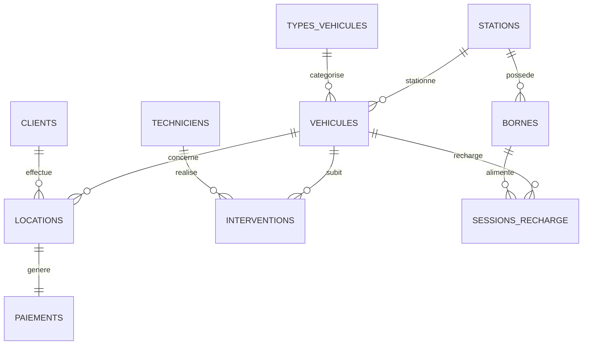

# 🚗 cIAra Mobility - Base de Données

> Système de gestion de locations de véhicules électriques partagés


## 📋 Description

**cIAra Mobility** est une start-up innovante spécialisée dans la mobilité urbaine durable. Ce projet implémente une base de données PostgreSQL complète pour gérer :

- 🚗 Flotte de véhicules électriques (voitures, scooters, trottinettes, vélos)
- 🔌 Stations et bornes de recharge
- 👥 Clients et techniciens
- 📅 Locations et réservations
- 💳 Paiements
- 🔧 Interventions de maintenance

## 🗂️ Structure du Projet

```
Clara_Mobility_sql/
├── 📁 data/
│   └── vehicules_cIara_2025.csv    # Données initiales (200 véhicules)
├── 📁 docs/
│   ├── MCD.md                       # Modèle Conceptuel de Données
│   ├── MLD.md                       # Modèle Logique de Données
│   └── dictionnaire_donnees.md      # Description des attributs
├── 📁 front/
│   ├── index.html                   # Interface visualisation
│   ├── app.js                       # Logique JavaScript
│   └── style.css                    # Styles CSS
├── 📁 init-db/                      # 🐳 Scripts Docker (auto-exécutés)
│   ├── 01_create_tables.sql
│   ├── 02_insert_data.sql
│   └── 03_queries.sql
├── 📁 scripts/                      # 💻 Scripts installation manuelle
│   ├── 01_create_database.sql       # Création de la base
│   ├── 02_create_tables.sql         # Structure des tables
│   ├── 03_insert_data.sql           # Données de test
│   └── 04_queries.sql               # Requêtes avancées
├── .env.example                     # 🐳 Template configuration Docker
├── docker-compose.yml               # 🐳 Configuration Docker Compose
└── README.md
```

## 🏗️ Schéma de la Base de Données



### Tables principales

| Table | Description | Lignes |
|-------|-------------|--------|
| `types_vehicules` | Catégories de véhicules | 4 |
| `stations` | Points de stationnement | 10 |
| `bornes` | Bornes de recharge | 25 |
| `vehicules` | Flotte de véhicules | 200 |
| `clients` | Utilisateurs | 15 |
| `techniciens` | Personnel maintenance | 5 |
| `locations` | Historique locations | 25 |
| `paiements` | Transactions | 25 |
| `interventions` | Opérations maintenance | 13 |
| `sessions_recharge` | Sessions de recharge | 15 |

## 🚀 Installation

Deux méthodes d'installation sont disponibles. Choisissez celle qui convient le mieux à votre environnement.

---

### 🐳 Méthode 1 : Docker (Recommandée)

Installation rapide avec Docker Compose. La base de données est automatiquement créée et initialisée.

#### Prérequis

- [Docker](https://www.docker.com/get-started) et Docker Compose installés
- Port 5432 disponible

#### Démarrage rapide

```bash
# Cloner le dépôt
git clone https://github.com/[votre-username]/Clara_Mobility_sql.git
cd Clara_Mobility_sql

# (Optionnel) Personnaliser les identifiants
cp .env.example .env
# Éditer .env avec votre mot de passe

# Démarrer PostgreSQL
docker-compose up -d

# Vérifier que le conteneur fonctionne
docker-compose ps
```

#### Connexion à la base

```bash
# Via psql dans le conteneur
docker-compose exec postgres psql -U ciara_admin -d ciara_mobility

# Ou depuis votre machine (si psql installé)
psql -h localhost -U ciara_admin -d ciara_mobility
```

#### Commandes utiles

| Commande | Description |
|----------|-------------|
| `docker-compose up -d` | Démarrer en arrière-plan |
| `docker-compose down` | Arrêter les conteneurs |
| `docker-compose logs -f postgres` | Voir les logs |
| `docker-compose down -v` | Supprimer + effacer les données |

---

### 💻 Méthode 2 : Installation Manuelle (Legacy)

Installation traditionnelle avec PostgreSQL installé localement. Plus de contrôle mais configuration manuelle.

#### Prérequis

- PostgreSQL 14+ installé
- Client psql ou pgAdmin

#### Étapes d'installation

1. **Cloner le dépôt**
```bash
git clone https://github.com/[votre-username]/Clara_Mobility_sql.git
cd Clara_Mobility_sql
```

2. **Créer la base de données**
```bash
psql -U postgres -f scripts/01_create_database.sql
```

3. **Créer les tables**
```bash
psql -U postgres -d ciara_mobility -f scripts/02_create_tables.sql
```

4. **Insérer les données**
```bash
psql -U postgres -d ciara_mobility -f scripts/03_insert_data.sql
```

5. **Créer les requêtes, vues et triggers**
```bash
psql -U postgres -d ciara_mobility -f scripts/04_queries.sql
```

#### Connexion à la base

```bash
psql -U postgres -d ciara_mobility
```

## 📊 Exemples de Requêtes

### Véhicules disponibles par ville
```sql
SELECT v.marque, v.modele, s.ville
FROM vehicules v
INNER JOIN stations s ON v.id_station = s.id_station
WHERE v.etat = 'Disponible';
```

### Top 5 clients les plus actifs
```sql
SELECT c.nom, c.prenom, COUNT(l.id_location) AS locations
FROM clients c
LEFT JOIN locations l ON c.id_client = l.id_client
GROUP BY c.id_client
ORDER BY locations DESC
LIMIT 5;
```

### Calculer le coût d'une location
```sql
SELECT fn_calculer_cout_location(60, 25.5, 1);
-- 60 min, 25.5 km, type voiture
```

## 🔧 Fonctionnalités Avancées

### Vues
- `vue_tableau_bord_vehicules` - Dashboard complet des véhicules
- `vue_activite_clients` - Statistiques clients

### Triggers
- `trg_update_vehicule_status` - MAJ automatique statut véhicule
- `trg_update_borne_status` - MAJ automatique statut borne

### Fonctions
- `fn_calculer_cout_location()` - Calcul du coût
- `fn_stats_station()` - Statistiques par station
- `fn_vehicule_disponible()` - Vérification disponibilité

## 📚 Documentation

- [📐 MCD - Modèle Conceptuel](docs/MCD.md)
- [📋 MLD - Modèle Logique](docs/MLD.md)
- [📖 Dictionnaire de Données](docs/dictionnaire_donnees.md)

## 👥 Équipe

| Membre | Rôle |
|--------|------|
| [Nom 1] | Modélisation & SQL |
| [Nom 2] | Requêtes & Documentation |

## 📅 Informations Projet

- **Module** : SQL B2
- **École** : Ynov
- **Date de rendu** : 7 janvier 2026
- **Date oral** : 8 janvier 2026

---

*Projet réalisé dans le cadre du cursus B2 Informatique - Ynov 2025-2026*
