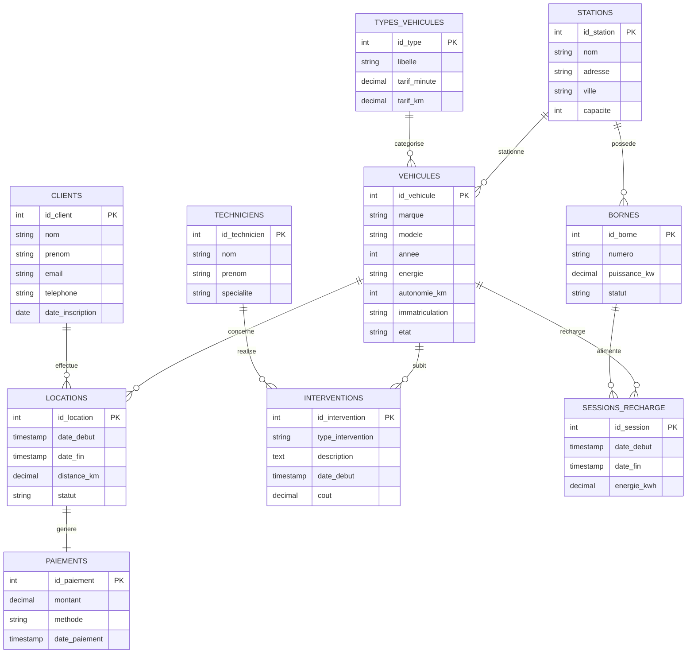

# Modèle Conceptuel de Données (MCD)
## cIAra Mobility - Gestion de Véhicules Électriques Partagés

---

## Diagramme MCD

---

## Entités et Relations

### Entités principales

| Entité | Description | Identifiant |
|--------|-------------|-------------|
| **TYPES_VEHICULES** | Catégories de véhicules (voiture, scooter, trottinette, vélo) | id_type |
| **VEHICULES** | Flotte de véhicules électriques | id_vehicule |
| **STATIONS** | Points de stationnement et recharge | id_station |
| **BORNES** | Bornes de recharge individuelles | id_borne |
| **CLIENTS** | Utilisateurs du service | id_client |
| **TECHNICIENS** | Personnel de maintenance | id_technicien |
| **LOCATIONS** | Réservations et locations | id_location |
| **PAIEMENTS** | Transactions financières | id_paiement |
| **INTERVENTIONS** | Opérations de maintenance | id_intervention |
| **SESSIONS_RECHARGE** | Sessions de recharge des véhicules | id_session |

### Associations et Cardinalités

| Association | Entité 1 | Cardinalité | Entité 2 | Cardinalité |
|-------------|----------|-------------|----------|-------------|
| categorise | TYPES_VEHICULES | 1,1 | VEHICULES | 0,n |
| possede | STATIONS | 1,1 | BORNES | 0,n |
| stationne | STATIONS | 0,1 | VEHICULES | 0,n |
| effectue | CLIENTS | 1,1 | LOCATIONS | 0,n |
| concerne | VEHICULES | 1,1 | LOCATIONS | 0,n |
| genere | LOCATIONS | 1,1 | PAIEMENTS | 1,1 |
| realise | TECHNICIENS | 1,1 | INTERVENTIONS | 0,n |
| subit | VEHICULES | 1,1 | INTERVENTIONS | 0,n |
| alimente | BORNES | 1,1 | SESSIONS_RECHARGE | 0,n |
| recharge | VEHICULES | 1,1 | SESSIONS_RECHARGE | 0,n |

---

## Règles de Gestion

1. Un véhicule appartient à un seul type
2. Une station peut contenir plusieurs bornes et véhicules
3. Un client peut effectuer plusieurs locations
4. Chaque location génère un paiement unique
5. Un technicien peut réaliser plusieurs interventions
6. Un véhicule peut subir plusieurs interventions et sessions de recharge
