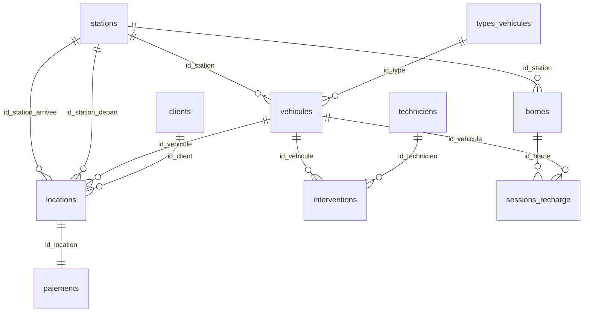

# Modèle Logique de Données (MLD)
## cIAra Mobility - Schéma Relationnel PostgreSQL

---

## Schéma Relationnel

```
TYPES_VEHICULES (id_type, libelle, tarif_minute, tarif_km)
    PK: id_type

STATIONS (id_station, nom, adresse, ville, code_postal, latitude, longitude, capacite)
    PK: id_station

VEHICULES (id_vehicule, id_type, id_station, marque, modele, annee, energie, autonomie_km, immatriculation, etat, date_ajout)
    PK: id_vehicule
    FK: id_type REFERENCES TYPES_VEHICULES(id_type)
    FK: id_station REFERENCES STATIONS(id_station)
    UNIQUE: immatriculation

BORNES (id_borne, id_station, numero, type_connecteur, puissance_kw, statut)
    PK: id_borne
    FK: id_station REFERENCES STATIONS(id_station)

CLIENTS (id_client, nom, prenom, email, telephone, date_naissance, permis_numero, date_inscription, actif)
    PK: id_client
    UNIQUE: email
    UNIQUE: permis_numero

TECHNICIENS (id_technicien, nom, prenom, email, telephone, specialite, date_embauche)
    PK: id_technicien
    UNIQUE: email

LOCATIONS (id_location, id_client, id_vehicule, id_station_depart, id_station_arrivee, date_debut, date_fin, distance_km, statut)
    PK: id_location
    FK: id_client REFERENCES CLIENTS(id_client)
    FK: id_vehicule REFERENCES VEHICULES(id_vehicule)
    FK: id_station_depart REFERENCES STATIONS(id_station)
    FK: id_station_arrivee REFERENCES STATIONS(id_station)

PAIEMENTS (id_paiement, id_location, montant, methode, statut, date_paiement)
    PK: id_paiement
    FK: id_location REFERENCES LOCATIONS(id_location)

INTERVENTIONS (id_intervention, id_vehicule, id_technicien, type_intervention, description, date_debut, date_fin, cout, statut)
    PK: id_intervention
    FK: id_vehicule REFERENCES VEHICULES(id_vehicule)
    FK: id_technicien REFERENCES TECHNICIENS(id_technicien)

SESSIONS_RECHARGE (id_session, id_vehicule, id_borne, date_debut, date_fin, energie_kwh, cout)
    PK: id_session
    FK: id_vehicule REFERENCES VEHICULES(id_vehicule)
    FK: id_borne REFERENCES BORNES(id_borne)
```

---

## Transformation MCD → MLD

### Règles appliquées

| Type d'association | Règle de transformation |
|-------------------|------------------------|
| **1,n** | La clé primaire côté "1" devient FK côté "n" |
| **n,n** | Création d'une table d'association avec 2 FK |
| **1,1** | FK dans la table la plus dépendante |

### Transformations effectuées

1. **TYPES_VEHICULES (1) → VEHICULES (n)**
   - `id_type` ajouté comme FK dans VEHICULES

2. **STATIONS (1) → VEHICULES (n)**
   - `id_station` ajouté comme FK dans VEHICULES

3. **STATIONS (1) → BORNES (n)**
   - `id_station` ajouté comme FK dans BORNES

4. **CLIENTS (1) → LOCATIONS (n)**
   - `id_client` ajouté comme FK dans LOCATIONS

5. **VEHICULES (1) → LOCATIONS (n)**
   - `id_vehicule` ajouté comme FK dans LOCATIONS

6. **LOCATIONS (1) → PAIEMENTS (1)**
   - `id_location` ajouté comme FK dans PAIEMENTS

7. **TECHNICIENS (1) → INTERVENTIONS (n)**
   - `id_technicien` ajouté comme FK dans INTERVENTIONS

8. **VEHICULES (1) → INTERVENTIONS (n)**
   - `id_vehicule` ajouté comme FK dans INTERVENTIONS

---

## Diagramme des Tables



---

## Contraintes d'Intégrité

### Clés Primaires (PK)
Toutes les tables utilisent un `SERIAL` (auto-incrémenté) comme clé primaire.

### Clés Étrangères (FK)
- `ON DELETE RESTRICT` par défaut (protection des données)
- `ON UPDATE CASCADE` pour propager les modifications

### Contraintes CHECK
- `etat IN ('Disponible', 'En service', 'En maintenance', 'Hors service')`
- `annee BETWEEN 2015 AND 2030`
- `autonomie_km > 0`
- `montant >= 0`
- `puissance_kw > 0`

### Contraintes UNIQUE
- `immatriculation` dans VEHICULES
- `email` dans CLIENTS et TECHNICIENS
- `permis_numero` dans CLIENTS
